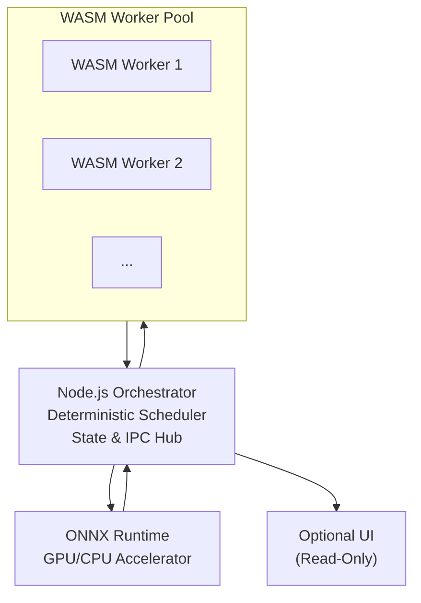

# Wasm-Engine: A Local-First, Deterministic Multi-Agent Runtime

Wasm-Engine is the blueprint for a shared execution runtime designed for a new generation of local-first, multi-agent AI systems. The runtime supports deterministic, reproducible, and safe execution of heterogeneous agents—including CPU-bound decision logic and GPU-accelerated ML inference—while remaining fully operable in headless environments.

This project is architected to provide a unified, stable contract for the entire agent lifecycle, including scheduling, communication, memory semantics, and compute abstraction.

## Core Principles

-   **Deterministic**: Identical input sequences must yield identical global system behavior across runs and platforms. This is the core guarantee of the runtime.
-   **Local-First**: The runtime must fully operate without UI or cloud connectivity.
-   **Headless-First**: All visualization components are optional and strictly decoupled. The core runtime does not depend on a UI.
-   **Secure & Isolated**: Agents are executed in a sandboxed WASM environment, preventing them from accessing the host system or interfering with each other.

---

## High-Level Architecture

The runtime's architecture is built on a foundation of open standards and is designed for modularity and performance.



The key components are:
1.  **Node.js Orchestrator**: A single-threaded, deterministic scheduler that acts as the single source of truth for all agent activity and communication.
2.  **WASM Worker Pool**: Executes agent logic in secure, sandboxed WebAssembly environments, providing isolation and safety.
3.  **ONNX Runtime**: Manages and executes GPU-bound inference tasks with a transparent CPU fallback, ensuring functional determinism.
4.  **Optional UI**: A completely decoupled visualization layer that subscribes to a read-only state channel, ensuring it has no performance impact on the core runtime.

---

## Project Documentation

This repository contains the complete architectural and product documentation for the Wasm-Engine. For a deep dive into the system's design and goals, please refer to the following key documents:

-   **[Product Requirements Document (PRD)](./docs/PRD-local-first-multi-agent-runtime.md)**: Defines the product vision, goals, and functional requirements.
-   **[Master Architecture Design (MAD)](./docs/MAD-hybrid-runtime-architecture.md)**: Provides the high-level technical architecture and design principles.
-   **[Architecture Decision Record (ADR-001)](./docs/001-hybrid-runtime-architecture.md)**: Justifies the core architectural decision to use ONNX Runtime over other alternatives.
-   **[Technical Critique of the PRD](./docs/critique-of-prd.md)**: A deep-dive analysis of the architectural implications and second-order challenges.

---

## Getting Started

This project is currently in the architectural design and documentation phase. The next steps will focus on the implementation of the core runtime as detailed in the **[Product Requirements Document](./docs/PRD-local-first-multi-agent-runtime.md)**.

Key Phase 0 deliverables will include:
-   A functional Node.js orchestrator with a deterministic scheduler.
-   A robust WASM worker pool for agent execution.
-   Integration with the ONNX Runtime for inference tasks.

## Directory Structure

```
.
├── apps/                 # Placeholder for main application(s)
├── docs/                 # All project documentation
│   ├── reports/
│   ├── summaries/
│   ├── onboarding/
│   ├── PRD-local-first-multi-agent-runtime.md
│   ├── MAD-hybrid-runtime-architecture.md
│   └── 001-hybrid-runtime-architecture.md
├── packages/             # Placeholder for reusable modules
└── README.md
```
