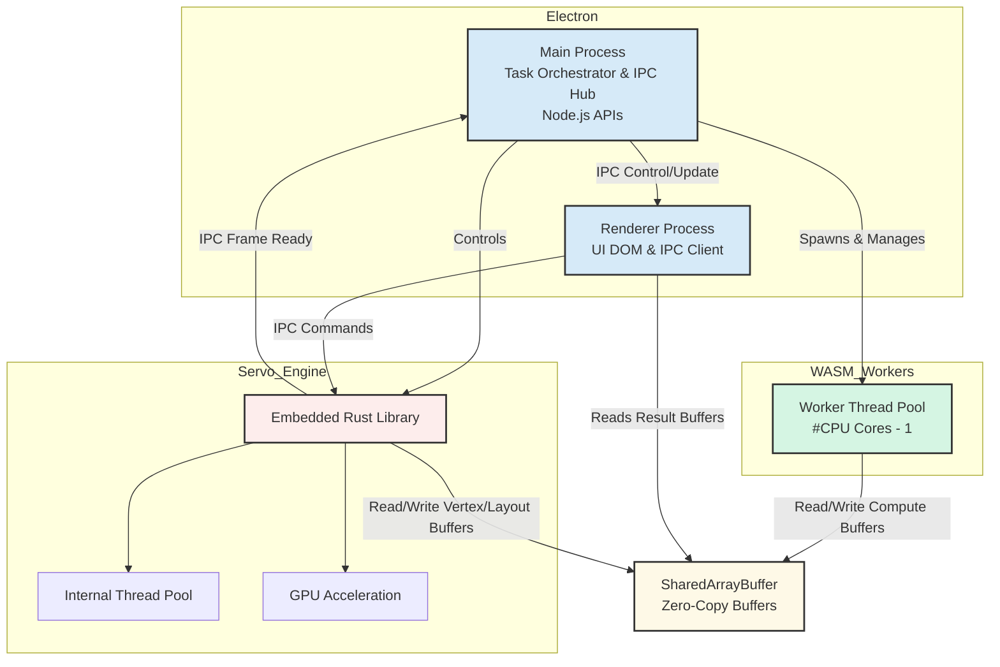

# Architecture Design Document: Electron + Servo + WASM Stack

## 1. Overview

This architecture combines:
- **Electron**: Desktop application framework (Node.js + Chromium) for UI, OS integration, and orchestration.
- **Servo**: Multi-threaded Rust-based rendering engine for GPU-accelerated layout and high-performance rendering tasks.
- **WebAssembly (WASM)**: High-performance CPU-bound modules compiled from Rust or C/C++ for compute-heavy operations (simulation, physics, data processing).

### Goals:
- Maximize CPU/GPU throughput for computation and rendering tasks.
- Maintain responsive UI in Electron main and renderer processes.
- Minimize memory copy overhead via shared memory buffers.
- Enable scalable parallelism using worker threads and Servo’s multi-threaded engine.

---

## 2. System Components

### 2.1 Electron Layer
- **Responsibilities**:
    - UI rendering and DOM management
    - Node.js API access (file system, networking)
    - Orchestration of worker threads and WASM modules
- **Processes**:
    - **Main process**: Manages app lifecycle, orchestrates tasks, IPC hub.
    - **Renderer process**: Displays UI, communicates with WASM/Servo via IPC.

### 2.2 Servo Layer
- **Responsibilities**:
    - Multi-threaded rendering
    - Layout calculations
    - GPU acceleration
- **Integration**:
    - Embedded as Rust library (`servo_embed`) inside a dedicated process or thread pool
    - Communicates with Electron via IPC or native bindings
- **Memory Access**:
    - Uses WASM shared buffers for exchanging renderable data

### 2.3 WebAssembly Layer
- **Responsibilities**:
    - CPU-heavy computation (physics, simulations, transformations)
    - Data processing on large datasets
- **Integration**:
    - Loaded inside Node.js (Electron main process or worker threads)
    - Preallocated `SharedArrayBuffer` for data exchange
    - SIMD and multithreaded WASM compiled for performance

---

## 3. Data Flow & Communication

- **Shared Memory Buffers**: Single source of truth for large data, avoids copying between WASM and Servo.
- **IPC Channels**: Electron main ↔ renderer ↔ Servo handle control messages, task scheduling, and small metadata.




---

## 4. Memory Architecture
- `SharedArrayBuffer` used for both WASM and Servo.
- **Memory layout example**:
```
+-------------------------+
| Control / Metadata      |  <- small JS objects / flags
+-------------------------+
| Vertex / Layout Buffers |  <- Servo reads/writes
+-------------------------+
| Compute Buffers (WASM)  |  <- WASM reads/writes
+-------------------------+
| Result Buffers          |  <- Electron reads for UI
+-------------------------+
```
- Preallocate buffers at startup; avoid dynamic resizing during runtime.
- Access via `TypedArray`s for zero-copy interaction between WASM and JS.

---

## 5. Task & Worker Management

### 5.1 Worker Thread Pool
- **Number of workers** = `#CPU cores - 1` (reserve one for Electron main)
- **Responsibilities**:
    - Load WASM module once per worker
    - Batch CPU-heavy tasks
    - Write results into shared buffers
    - Task scheduling via queue in main process

### 5.2 Servo Thread Pool
- Servo manages its own threads for layout/rendering
- Reads input buffers, writes output buffers
- Notifies Electron main via IPC when rendering frames are ready

---

## 6. Performance Considerations
1.  **Minimize JS ↔ WASM crossings**
    - Batch operations
    - Use indices/pointers into shared memory instead of passing arrays
2.  **Minimize IPC overhead**
    - Only send metadata or signals, not large arrays
    - Keep heavy data in shared buffers
3.  **SIMD and multithreading**
    - WASM compiled with `+simd128` and atomic memory operations
    - Servo leverages GPU and CPU cores
4.  **Non-blocking UI**
    - All heavy computation offloaded to workers
    - Electron main thread remains responsive

---

## 7. Example Initialization Workflow
1.  Electron main process initializes:
    - Worker thread pool
    - Shared memory buffers
    - Servo embedded engine
2.  Renderer process initializes UI
3.  WASM modules load into workers with access to shared buffers
4.  Electron schedules tasks:
    - Updates layout/render requests → Servo
    - Sends CPU-heavy calculations → WASM workers
5.  Data processed in parallel, results written to shared buffers
6.  Renderer reads buffers to update UI

---

## 8. Build & Deployment Strategy
- **Rust/WASM**
    - Compile WASM with `--release + SIMD + threading`
    - Optimize with `wasm-opt -O3`
- **Servo**
    - Compile as Rust library for target OS
- **Electron**
    - Standard Electron build, preload WASM + Servo modules
- **Cross-platform**
    - All shared buffers and IPC mechanisms abstracted

---

## 9. Future Enhancements
- GPU acceleration for WASM (WebGPU via Electron)
- Dynamic worker scaling based on CPU load
- Advanced scheduling: prioritize rendering frames vs. computation
- WASI integration for direct system access in WASM
