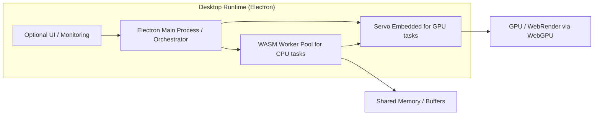

# ADR-001: Hybrid Runtime Architecture for Local-First Multi-Agent and WebLLM Compute

**Status**: Proposed / Engineering Review
**Date**: 2025-12-12

---

## 1. Context

We aim to build a local-first, high-performance runtime for:
- Multi-agent orchestration
- Local inference of small to medium LLMs
- Optional monitoring UI

The runtime must:
1.  Support CPU-bound computation (agent logic, inference) efficiently.
2.  Support GPU-bound computation (matrix-heavy operations) locally.
3.  Operate in headless and non-headless modes.
4.  Ensure deterministic scheduling, low-latency communication, and safe sandboxing for multiple agents.

**Constraints**:
- Must run fully offline.
- Avoid external cloud dependencies.
- Leverage existing technologies (Node.js, Electron, WebAssembly, Servo) where practical.

---

## 2. Decision

Adopt a hybrid runtime architecture combining:
1.  **Electron** as the desktop runtime and optional UI orchestrator.
2.  **WebAssembly (WASM)** modules for CPU-bound agent logic and inference tasks.
3.  **Servo WebGPU** for GPU-bound tasks (matrix multiplications, tensor ops, LLM acceleration).

**Key design principles**:
- **Headless mode**: Servo handles GPU tasks without UI; WASM handles CPU tasks.
- **Non-headless mode**: Optional Electron UI monitors agents, orchestrates tasks; Servo still handles GPU compute.
- **Shared memory buffers**: Zero-copy communication between WASM and Servo GPU tasks.
- **Deterministic scheduling**: Main Electron process orchestrates tasks; WASM workers execute CPU tasks; Servo asynchronously handles GPU workloads via WGPU thread + poller.

---

## 3. Rationale

| Requirement                 | Why this approach                                                                                             |
| --------------------------- | ------------------------------------------------------------------------------------------------------------- |
| **CPU-bound computation**   | WASM provides near-native performance with sandboxing; worker threads allow parallel agent execution.         |
| **GPU-bound computation**   | Servo WebGPU exposes a dedicated GPU thread and async pipeline, unlike Electron's `unsafe WebGPU` which is renderer-dependent and unstable. |
| **Headless operation**      | Servo allows GPU tasks without a UI; Electron is optional for Node.js-based orchestration.                    |
| **UI integration**          | Electron enables an optional UI for monitoring or debugging without interfering with core compute tasks.        |
| **Low-latency coordination**| Shared memory between WASM and Servo minimizes data copying overhead for agent communication.                   |
| **Safety and isolation**    | WASM sandboxing and Servo's thread isolation prevent faults from propagating across agents.                    |

---

## 4. Architecture Overview

**Data Flow**:
1.  `MainProcess` schedules CPU/GPU tasks.
2.  WASM workers in the `WorkerPool` execute CPU-bound logic; intermediate results are stored in shared memory.
3.  `ServoRuntime` executes GPU-bound computations asynchronously via WebGPU.
4.  Results propagate back to the orchestrator and, optionally, to the UI.

---

## 5. Consequences

**Benefits**:
- High-performance hybrid CPU + GPU architecture.
- Headless GPU compute is possible via Servo.
- Safe sandboxing of agents via WASM.
- Optional UI for monitoring without impacting core compute performance.
- Shared memory enables zero-copy data transfer between components.

**Trade-offs / Risks**:
- Servo's WebGPU implementation is experimental; feature gaps and performance limitations may exist.
- Architecture complexity increases with the integration of multiple runtime environments.
- The Electron UI component can be omitted in headless deployments to simplify the stack.
- GPU compute performance via Servo may not match native CUDA/Vulkan performance for highly specialized tasks.
- Requires careful thread and memory management to avoid race conditions and ensure stability.

---

## 6. Alternatives Considered

| Option                                  | Pros                                                              | Cons                                                                                        |
| --------------------------------------- | ----------------------------------------------------------------- | ------------------------------------------------------------------------------------------- |
| **Electron + WASM only**                | Stable, mature, and easy to package.                              | No reliable GPU acceleration; `unsafe WebGPU` is experimental and has poor performance for matrix-heavy LLM tasks. |
| **Servo only (headless)**               | Direct GPU compute and multi-threaded rendering.                  | Limited desktop integration, no built-in orchestration UI, and harder packaging.             |
| **Node.js + native GPU libs (CUDA/Vulkan)** | Highest-performance compute.                                      | Platform-specific; cross-platform packaging and integration are significantly harder; introduces more dependencies. |

**Decision Justification**: The proposed hybrid architecture provides the best balance of features: cross-platform packaging, an optional UI, high-performance CPU workers via WASM, and dedicated GPU acceleration through Servo. This combination is suitable for both headless and non-headless use cases.

---

## 7. Next Steps

1.  Prototype the WASM + Servo GPU integration with a simple LLM inference pipeline.
2.  Establish and document the shared memory conventions between WASM workers and Servo GPU tasks.
3.  Implement an optional Electron UI to monitor agent execution and GPU task status.
4.  Formally document the threading, scheduling, and fault isolation strategies.
5.  Evaluate performance and iterate on GPU task batching for Servo's WebGPU implementation.

---

**Decision Owner**: Engineering Team
**Reviewers**: Engineering Team
