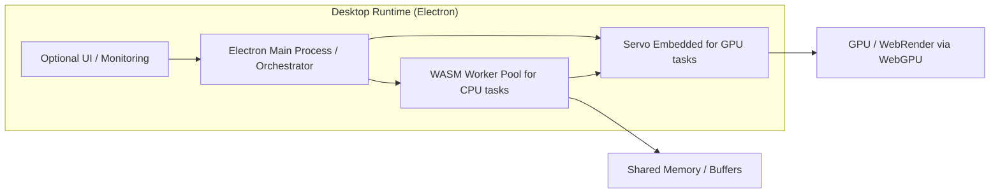

# Hybrid Runtime Technology Selection
## Architecture Decision Record

---

## 1. Context

We aim to build a local-first, high-performance runtime for:
	•	Multi-agent orchestration
	•	Local inference of small to medium LLMs
	•	Optional monitoring UI

The runtime must:
	1.	Support CPU-bound computation (agent logic, inference) efficiently.
	2.	Support GPU-bound computation (matrix-heavy operations) locally.
	3.	Operate in headless and non-headless modes.
	4.	Ensure deterministic scheduling, low-latency communication, and safe sandboxing for multiple agents.

**Constraints**:
	•	Must run fully offline.
	•	Avoid external cloud dependencies.
	•	Leverage existing technologies (Node.js, Electron, WebAssembly, Servo) where practical.

---

## 2. Decision

Adopt a hybrid runtime architecture combining:
	1.	**Electron** as the desktop runtime and optional UI orchestrator.
	2.	**WebAssembly (WASM)** modules for CPU-bound agent logic and inference tasks.
	3.	**Servo WebGPU** for GPU-bound tasks (matrix multiplications, tensor ops, LLM acceleration).

**Key design principles**:
	•	**Headless mode**: Servo handles GPU tasks without UI; WASM handles CPU tasks.
	•	**Non-headless mode**: Optional Electron UI monitors agents, orchestrates tasks; Servo still handles GPU compute.
	•	**Shared memory buffers**: Zero-copy communication between WASM and Servo GPU tasks.
	•	**Deterministic scheduling**: Main Electron process orchestrates tasks; WASM workers execute CPU tasks; Servo asynchronously handles GPU workloads via WGPU thread + poller.

---

## 3. Rationale

| Requirement | Why this approach |
| :--- | :--- |
| CPU-bound computation | WASM provides near-native performance with sandboxing; worker threads allow parallel agent execution |
| GPU-bound computation | Servo WebGPU exposes a dedicated GPU thread and async pipeline, unlike Electron unsafe WebGPU which is renderer-dependent and unstable |
| Headless operation | Servo allows GPU tasks without UI; Electron optional for Node.js orchestration |
| UI integration | Electron enables optional UI for monitoring or debugging without interfering with compute tasks |
| Low-latency agent coordination | Shared memory between WASM and Servo minimizes data copying overhead |
| Safety and isolation | WASM sandboxing + Servo thread isolation prevent faults from propagating across agents |

---

## 4. Architecture Overview

**Data Flow**:
	1.	MainProcess schedules CPU/GPU tasks.
	2.	WASM workers execute CPU-bound logic; intermediate results stored in shared memory.
	3.	Servo WebGPU executes GPU-bound computations asynchronously.
	4.	Results propagate back to orchestrator and optionally to UI.

---

## 5. Consequences

**Benefits**:
	•	High-performance hybrid CPU + GPU architecture.
	•	Headless GPU compute possible via Servo.
	•	Safe sandboxing of agents via WASM.
	•	Optional UI for monitoring without impacting compute.
	•	Shared memory enables zero-copy data transfer.

**Trade-offs / Risks**:
	•	Servo WebGPU is experimental; feature gaps and performance limitations exist.
	•	Architecture complexity increases with multiple runtimes.
	•	Electron UI may not be needed in headless deployments; can be omitted to simplify.
	•	GPU compute via Servo may not match native CUDA/Vulkan performance.
	•	Requires careful thread and memory management to avoid race conditions.

---

## 6. Alternatives Considered

| Option | Pros | Cons |
| :--- | :--- | :--- |
| Electron + WASM only | Stable, mature, easy to package | No reliable GPU acceleration; unsafe WebGPU experimental; poor performance for matrix-heavy LLM tasks |
| Servo only (headless) | Direct GPU compute, multi-threaded | Limited desktop integration, no orchestration UI, harder packaging |
| Node.js + native GPU libs (CUDA/Vulkan) | High-performance compute | Platform-specific; cross-platform packaging and integration harder; more dependencies |

**Decision justification**: Hybrid architecture provides a balanced solution: cross-platform packaging + optional UI + WASM CPU workers + Servo GPU acceleration, suitable for both headless and non-headless use cases.

---

## 7. Next Steps
	1.	Prototype WASM + Servo GPU integration with a simple LLM inference pipeline.
	2.	Establish shared memory conventions between WASM workers and Servo GPU tasks.
	3.	Optional Electron UI to monitor agent execution and GPU task status.
	4.	Document threading, scheduling, and fault isolation strategies.
	5.	Evaluate performance and iterate on GPU task batching for Servo WebGPU.

---
