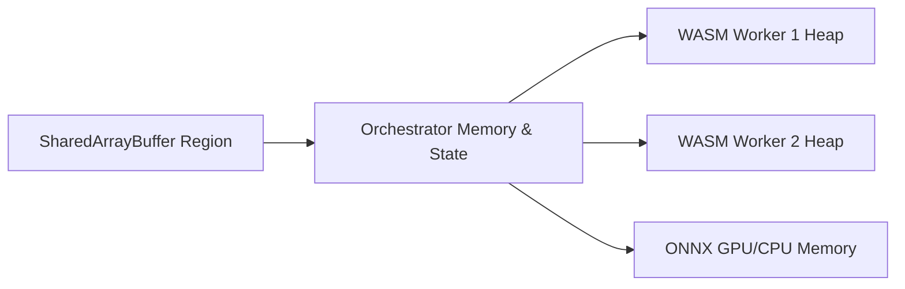
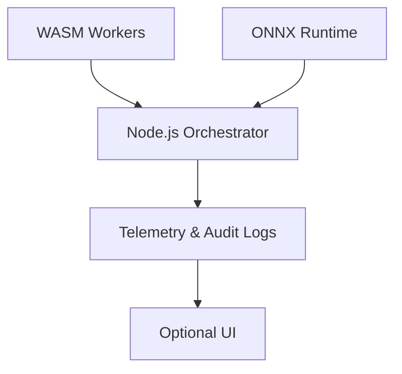
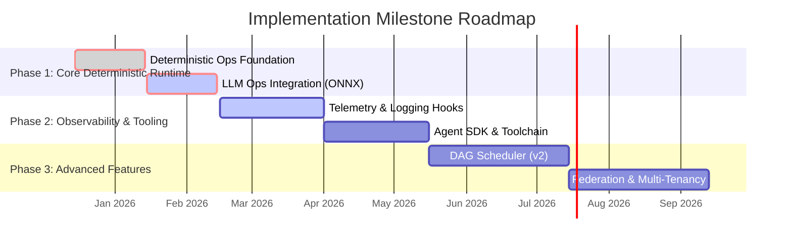

# Runtime Architecture for Multi-Agent Orchestration: WebAssembly (WASM) Stack

**Status**: Proposed
**Version**: 0.2
**Date**: 2025-12-13
**Owners**: [Engineering Team]
**Reviewers**: [CTO, Platform Architecture, ML Systems]
**Tags**: [Architecture, Runtime, Node.js, WASM, ONNX, Deterministic, Multi-Agent]

---

## 1. Abstract

This RFC defines the architecture for a local-first, deterministic multi-agent runtime built on WebAssembly (WASM) and Node.js. The system is designed to execute CPU-bound deterministic operations and GPU-accelerated ML/LLM inference in a fully sandboxed, headless-first environment. Optional UI components are strictly decoupled. The runtime enforces reproducibility, memory safety, secure plugin management, and operation-level observability while remaining cross-platform (Linux, Windows, macOS).

This document includes:
- System component specifications
- Memory and telemetry architecture
- Deterministic operation contracts
- Fault handling, recovery, and replay semantics
- Performance and reproducibility targets
- Build, deployment, and future extension roadmap

---

## 2. Goals & Design Principles

### Primary Goals
1.  **Deterministic Multi-Agent Execution**: Identical inputs must yield identical global system behavior across runs and platforms.
2.  **Hybrid Execution Support**: CPU-bound deterministic tasks and GPU/CPU-based ML/LLM inference treated as first-class operations.
3.  **Local-First, Headless-First**: Fully functional without UI or cloud connectivity. Visualization is optional and read-only.
4.  **Cross-Platform Consistency**: Linux, Windows, macOS; CPU fallback guarantees functional equivalence.
5.  **Safety & Isolation**: WASM sandboxing, controlled I/O, strict memory ownership.
6.  **Observability & Telemetry**: Operation-level logging, metrics, message tracing, and deterministic replay.
7.  **Extensible & Modular**: Loosely coupled components; versioned plugin ABI; future federation and multi-tenant support.

### Non-Goals
-   Distributed consensus or cross-machine state replication
-   Direct OS or GPU API access from agents
-   Embedded UI/graphical engine
-   Long-term persistence or database management

---

## 3. System Components

### 3.1 Node.js Orchestrator

**Responsibilities**:
-   Agent lifecycle management (spawn, pause, resume, terminate)
-   Deterministic scheduling (FIFO/priority; DAG deferred v2)
-   Global state management and deterministic logging
-   IPC hub for inter-component messaging
-   Plugin verification, ABI enforcement, capability declarations

### 3.2 WASM Worker Pool

**Responsibilities**:
-   Executes CPU-bound deterministic agent logic inside sandboxed workers
-   Memory-safe, isolated linear memory per agent
-   Instruction metering, bounded step execution, deterministic outputs
-   Receives typed messages and shared memory events via orchestrator

### 3.3 ONNX Runtime

**Responsibilities**:
-   Executes GPU-accelerated ML/LLM inference
-   CPU fallback ensures deterministic functional behavior
-   Model lifecycle management: load, unload, cache, version tracking
-   Controlled stochastic execution for LLM inference with replayable logs

### 3.4 Optional UI Layer

**Responsibilities**:
-   Read-only visualization of agent and runtime state
-   Dashboards for operation metrics, scheduling, and telemetry
-   Runs in a separate process; communicates via IPC
-   Cannot mutate agent or orchestrator state

---

## 4. Memory & Telemetry Architecture

### 4.1 Memory Model

**Key Principles**:
-   Each WASM worker has isolated linear memory.
-   `SharedArrayBuffer` for orchestrator ↔ worker communication; synchronized via Atomics.
-   Mutable state only flows through orchestrator.
-   ONNX memory fully managed by runtime; agents have no direct access.

### 4.2 Telemetry & Observability

**Telemetry Features**:
-   Operation-level logging: inputs, outputs, scheduling, resource usage
-   Message tracing: ordering, latency, throughput
-   Deterministic logging for replay
-   Optional UI dashboards for real-time monitoring
-   Append-only storage for auditability and compliance

---

## 5. Agent ABI & Plugin Security

**ABI Functions**:
-   `agent_init()`
-   `agent_step(context_ptr)`
-   `agent_receive(message_ptr)`
-   `agent_shutdown()`

**Plugin Security Model**:
-   Signed modules with declared capabilities
-   ABI version verification by orchestrator
-   No direct OS or GPU access; all operations brokered
-   Audit logs record module versions, capabilities, and execution

---

## 6. Determinism & Operation Contracts

| Subsystem      | Guarantee                                                                     |
| -------------- | ----------------------------------------------------------------------------- |
| Scheduler      | Deterministic FIFO/priority queue; tick clock; DAG scheduling deferred        |
| WASM Agent     | Bounded execution; deterministic outputs per input; no wall-clock I/O unless sandboxed |
| ONNX Runtime   | CPU deterministic; GPU deterministic where possible; CPU fallback preserves functional outputs |
| Messaging & Memory | `SharedArrayBuffer` + Atomics; all mutable state flows through orchestrator; messages replayable |
| Operations     | Typed input/output contracts; LLM ops controlled stochastic; deterministic replay supported |

---

## 7. Fault Handling & Recovery

-   Agent crashes isolated; orchestrator continues
-   WASM workers preempted via metering
-   ONNX failures fallback to CPU
-   Retry/backoff handled deterministically
-   Checkpointing & replay from logged inputs

---

## 8. Performance & Reproducibility Targets

| Metric                  | Target                                   |
| ----------------------- | ---------------------------------------- |
| Scheduler tick overhead | <10 ms per 50 active agents              |
| CPU agent step          | <5 ms                                    |
| ONNX inference variance | ±5% GPU; CPU deterministic bit-level     |
| Message throughput      | ≥10k messages/sec via orchestrator       |
| Shared memory latency   | <1 ms                                    |

---

## 9. Data Flow & Communication

-   **Orchestrator ↔ WASM Workers**: `SharedArrayBuffer` + Atomics; deterministic, thread-safe
-   **Orchestrator ↔ ONNX Runtime**: Typed inference requests; replayable output
-   **Orchestrator ↔ UI / External Processes**: Pull-based IPC snapshots; read-only

---

## 10. Build & Deployment

-   Compile Rust/C++ agent code to WASM with multi-threading/SIMD enabled
-   Node.js packaged runtime with `onnxruntime-node` dependencies
-   Cross-platform builds with native ONNX binaries
-   Signed module verification and deterministic build pipelines

---

## 11. Future Enhancements

-   DAG-based scheduler (v2) with explicit operation dependencies
-   Dynamic scaling of WASM worker pools
-   Multi-instance federation and multi-tenant agent sandboxes
-   WASI integration for controlled system resource access
-   GitOps-style operation deployment and workflow provenance tracking

---

## 12. ADR Index

---
adr_index:
  - id: ADR-001
    title: "Shared Runtime (Node.js + WASM + ONNX)"
    status: "Approved"
    scope: "Core orchestrator, CPU/GPU execution, optional UI"
    link: "./ADR-001-shared-runtime.md"

  - id: ADR-002
    title: "Ordering-Only Determinism"
    status: "Proposed"
    scope: "Scheduler & replay determinism"
    link: "./ADR-002-ordering-only-determinism.md"

  - id: ADR-003
    title: "Scheduler Tick Granularity"
    status: "Proposed"
    scope: "Logical tick duration, max tasks per tick"
    link: "./ADR-003-scheduler-tick-granularity.md"

  - id: ADR-004
    title: "Shared Memory Ownership Rules"
    status: "Proposed"
    scope: "Single-writer, multi-reader policies"
    link: "./ADR-004-shared-memory-ownership-rules.md"

  - id: ADR-005
    title: "Plugin Signing & ABI Enforcement"
    status: "Proposed"
    scope: "Module security and ABI versioning"
    link: "./ADR-005-plugin-signing-and-abi-enforcement.md"

  - id: ADR-006
    title: "Performance & Latency Targets"
    status: "Proposed"
    scope: "Metrics for CPU/GPU and messaging"
    link: "./ADR-006-performance-and-latency-targets.md"

  - id: ADR-007
    title: "Logging Format & Serialization"
    status: "Proposed"
    scope: "Deterministic event serialization"
    link: "./ADR-007-logging-format-and-serialization.md"

  - id: ADR-008
    title: "Optional UI Framework"
    status: "Proposed"
    scope: "Servo vs Electron usage, decoupling"
    link: "./ADR-008-optional-ui-framework.md"

  - id: ADR-009
    title: "Model Caching & GPU Memory Policy"
    status: "Proposed"
    scope: "LRU caching, preloading heuristics"
    link: "./ADR-009-model-caching-and-gpu-memory-policy.md"

  - id: ADR-010
    title: "Agent SDK & Toolchain"
    status: "Proposed"
    scope: "Languages, debugging, compliance tools"
    link: "./ADR-010-agent-sdk-and-toolchain.md"

  - id: ADR-011
    title: "Fault Injection & Stress Testing"
    status: "Proposed"
    scope: "Crash recovery and validation scenarios"
    link: "./ADR-011-fault-injection-and-stress-testing.md"

  - id: ADR-012
    title: "Cross-Platform Build & Packaging"
    status: "Proposed"
    scope: "Platform-specific artifacts and dependencies"
    link: "./ADR-012-cross-platform-build-and-packaging.md"

  - id: ADR-013
    title: "DAG Scheduler v2 Guidelines"
    status: "Proposed"
    scope: "Task objects, dependencies, v2 extensions"
    link: "./ADR-013-dag-scheduler-v2-guidelines.md"
---

---

## 13. Milestone Roadmap

---

## 14. References
-   **[Product Requirements Document (PRD)](./PRD-local-first-multi-agent-runtime.md)**
-   **[Authoritative Technical Specification Document (ATSD)](./ATSD.md)**
-   **[ADR-001: Shared Runtime Architecture](./ADR-001-shared-runtime.md)**
