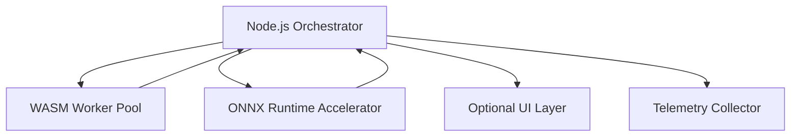
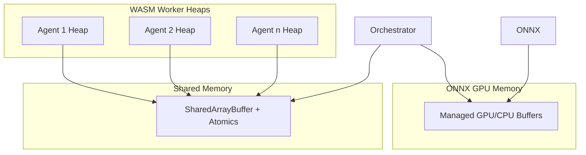

# Authoritative Technical Specification Document (ATSD)

**Title**: Shared Runtime: Node.js + WASM + ONNX Runtime for Local-First Multi-Agent Orchestration
**Status**: Draft
**Version**: 0.2
**Date**: 2025-12-13
**Owners**: Engineering Team
**Reviewers**: CTO, Platform Architecture, Runtime Team

---

## 1. Purpose

This ATSD defines the authoritative technical specification for a local-first, deterministic, multi-agent runtime. It codifies component contracts, memory and compute flows, communication protocols, telemetry hooks, and future-looking considerations like DAG scheduling and federation, providing a robust engineering contract aligned with the PRD and ADR.

The runtime must:
-   Execute CPU-bound agent logic in WASM sandboxes.
-   Execute GPU-bound inference via ONNX Runtime with CPU fallback.
-   Guarantee deterministic scheduling and reproducible system behavior.
-   Operate headless-first, optionally supporting a decoupled UI.

---

## 2. System Components & Contracts

### 2.1 Node.js Orchestrator
**Responsibilities**:
-   Lifecycle management of agents (spawn, step, terminate).
-   Deterministic scheduling (round-robin, priority, with placeholders for DAG).
-   Mediation of all inter-agent and external communication.
-   Maintenance of global state, snapshots, and telemetry hooks.

**Interface Contract Example**:
```typescript
interface Orchestrator {
  spawnAgent(spec: AgentSpec): AgentId;
  scheduleTask(agentId: AgentId, task: Task): void;
  publish(topic: string, message: Message): void;
  send(agentId: AgentId, message: Message): void;
  joinChannel(agentId: AgentId, channel: string): void;
  snapshotState(): Snapshot;
  registerTelemetryHook(hook: TelemetryHook): void;
}
```

**Deterministic Guarantees**:
-   Task execution order is reproducible across runs given identical inputs.
-   Snapshots can replay the exact system state evolution.

### 2.2 WASM Worker Pool
**Responsibilities**:
-   Execute CPU-bound agent logic in isolated sandboxes.
-   Enforce memory bounds and prevent orchestrator blocking.
-   Expose hooks for telemetry on each `agent_step`.

**WASM ABI**:
```c
int agent_init();
int agent_step(void* context_ptr);
int agent_receive(void* message_ptr);
int agent_shutdown();
```

**Memory Isolation**:
-   Each agent runs in a private linear heap.
-   Shared memory is accessed via `SharedArrayBuffer` + `Atomics`.
-   Zero mutable state is allowed to escape the sandbox.

### 2.3 ONNX Runtime Integration
**Responsibilities**:
-   Execute GPU-bound inference deterministically.
-   CPU fallback guarantees reproducible results on all platforms.
-   Batch inference and centralized model management.

**Interface Contract Example**:
```typescript
interface ModelRegistry {
  loadModel(modelId: string, version: string): void;
  unloadModel(modelId: string): void;
  infer(modelId: string, input: Tensor): Tensor;
  batchInfer(requests: Array<InferenceRequest>): Array<InferenceResponse>;
}
```
**Telemetry Hooks**: Latency per inference, GPU vs. CPU path, and memory usage.

### 2.4 Optional UI Layer
-   Read-only access via IPC (WebSockets or memory-mapped files).
-   Receives snapshots of agent state, task queues, and logs.
-   Must never mutate runtime state.

---

## 3. Data Flow & Memory Architecture

### 3.1 High-Level Data Flow


### 3.2 Memory Architecture

**Key Principles**:
-   Each WASM worker heap is fully isolated.
-   Shared memory is controlled and synchronized via `Atomics`.
-   GPU memory is managed exclusively by ONNX Runtime.
-   Snapshots are captured by the orchestrator for replay.

---

## 4. Message & Snapshot Schemas

### Agent Message Example
```json
{
  "agentId": "agent-123",
  "topic": "sensor_data",
  "payload": { "temperature": 22.5, "humidity": 45 },
  "timestamp": "2025-12-13T11:00:00Z"
}
```

### Task Example
```json
{
  "taskId": "task-456",
  "agentId": "agent-123",
  "priority": 5,
  "payload": { "compute": "embedding", "input": [1,2,3] }
}
```

### Snapshot Example
```json
{
  "agents": [ /* ... */ ],
  "schedulerQueue": [ /* ... */ ],
  "onnxModelStates": [ /* ... */ ],
  "timestamp": "2025-12-13T11:00:00Z"
}
```

---

## 5. Telemetry & Performance Metrics

| Component      | Metric                    | Expected                   |
| -------------- | ------------------------- | -------------------------- |
| Scheduler      | Tick latency              | <10ms under load           |
| WASM Workers   | Step time                 | <5ms per agent (CPU-bound) |
| ONNX Runtime   | Inference latency variance| <2% deviation CPU/GPU      |
| Memory         | Shared buffer throughput  | >100k ops/sec              |
| UI IPC         | Serialization latency     | <2ms                       |

Telemetry hooks are exposed at the orchestrator, WASM step, ONNX inference, and snapshot points. Data is logged in a structured format for replay.

---

## 6. Versioning & Hot-Swap Rules
-   **WASM ABI**: Semantic versioning; backwards-compatible extensions only.
-   **ONNX Models**: Versioned; orchestrator ensures deterministic swap points.
-   **Agent Modules**: Versioned; snapshots include module version hashes for replay.

---

## 7. Future Placeholders

### 7.1 Deterministic DAG Scheduling (v2)
-   The scheduler will accept task dependencies forming a DAG.
-   Tasks will execute in a topologically sorted order, respecting priority.
-   Ensures reproducibility for complex multi-agent workflows.

### 7.2 Federation & Multi-Tenancy
-   **Federation**: Snapshots can be serialized and transmitted between runtime instances; no shared memory across machines.
-   **Multi-Tenancy**: Resource isolation will be enforced per tenant, with scheduler quotas.

---

## 8. Acceptance Criteria
1.  Deterministic execution is reproducible across all target OSes.
2.  WASM workers maintain full isolation with no cross-agent memory leaks.
3.  ONNX inference is deterministic with a functional CPU fallback.
4.  The optional UI is strictly read-only and does not affect the runtime when attached or detached.
5.  The scheduler supports priority and round-robin modes.
6.  Telemetry metrics are collected per agent, per inference, and per tick.
7.  Snapshots can reproduce the identical global state.
