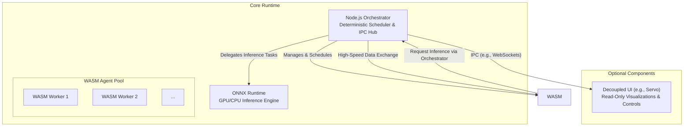

# Architecture Design: A Deterministic Runtime for Multi-Agent Systems

## 1. Overview & Core Principles

This document defines the architecture for a local-first, high-performance runtime designed to orchestrate multiple, heterogeneous agents. The system is built on a foundation of determinism, security, and modularity, enabling reproducible execution of complex CPU and GPU workloads in a headless-first environment.

This design is guided by the following core principles:

*   **Deterministic Execution**: All agent operations, state changes, and communications are ordered and reproducible. The system guarantees "Ordering-Only Determinism" (see ADR-002), ensuring logical consistency without imposing brittle bit-level constraints.
*   **Security through Sandboxing**: Agents are executed in isolated WebAssembly (WASM) environments, with a strict ABI and capability-based security model that prevents unauthorized access to system resources.
*   **Performance via Specialization**: The architecture delegates tasks to specialized components: CPU-bound logic runs in a multi-threaded WASM pool, while GPU-intensive machine learning inference is handled by the highly optimized ONNX Runtime.
*   **Modularity and Decoupling**: The core runtime is fully independent of any UI. An optional, read-only user interface can attach to the orchestrator for monitoring but is architecturally separate, ensuring the headless runtime remains lightweight and robust.
*   **Cross-Platform Consistency**: The runtime is designed to provide identical behavior across Linux, Windows, and macOS.

---

## 2. System Architecture

The runtime consists of three core components managed by a central orchestrator.

### 2.1. Node.js Orchestrator

The orchestrator is the heart of the system, acting as the central nervous system.
*   **Responsibilities**:
    *   **Agent Lifecycle**: Spawns, monitors, and terminates WASM agents.
    *   **Deterministic Scheduling**: Enforces a strict, reproducible execution order for all tasks using a logical clock and a configurable scheduling strategy (e.g., FIFO, priority-based).
    *   **IPC Hub**: Brokers all communication between agents and other system components. Direct agent-to-agent communication is prohibited.
    *   **State & Replay**: Manages global state and logs all events to enable deterministic replay.
    *   **Security Enforcement**: Verifies agent signatures and enforces ABI and capability constraints.

### 2.2. WebAssembly (WASM) Worker Pool

This is where agent-specific, CPU-bound logic is executed.
*   **Responsibilities**:
    *   **Sandboxed Logic**: Runs agent code in isolated Node.js `worker_threads`.
    *   **Resource Management**: Implements instruction metering and bounded step execution to prevent runaway processes.
    *   **ABI Compliance**: Interacts with the orchestrator through a well-defined, secure ABI.

### 2.3. ONNX Runtime

This component is dedicated to high-performance machine learning inference.
*   **Responsibilities**:
    *   **GPU & CPU Inference**: Executes ML models, transparently using GPU acceleration where available and falling back to the CPU otherwise.
    *   **Model Management**: Handles the lifecycle of ML models, including loading, caching, and versioning.
    *   **Deterministic Mode**: Configured to use deterministic kernels where possible to support the system's reproducibility goals.

---

## 3. Execution & Determinism Model

Determinism is the cornerstone of this architecture, ensuring that for a given sequence of inputs, the system's behavior is perfectly reproducible.

| Subsystem | Determinism Contract |
| :--- | :--- |
| **Scheduler** | A single, global event queue with a logical clock ensures a canonical ordering for all tasks, messages, and state transitions. |
| **WASM Agents** | Execution is metered and bounded. Agents are pure functions of their inputs; any I/O or access to a wall-clock is prohibited and must be brokered by the orchestrator. |
| **ONNX Runtime** | Provides functional reproducibility. CPU inference is bit-level deterministic. GPU inference, while not bit-level identical, produces semantically equivalent results. The CPU fallback guarantees a consistent baseline. |
| **Communication** | All state-mutating communication flows through the orchestrator. Message order is guaranteed, and all interactions are logged for replay. |

---

## 4. Communication & Data Flow

Communication is designed for both high performance and strict security.

*   **Orchestrator ↔ WASM Agents**: A pre-allocated `SharedArrayBuffer` is used for zero-copy, high-speed data exchange. All access is synchronized with `Atomics` to prevent race conditions and ensure thread safety.
*   **Orchestrator ↔ UI**: Communication with the optional UI occurs over a standard IPC mechanism like WebSockets or memory-mapped files. This is a pull-based model where the UI requests snapshots, ensuring it cannot block or impact the performance of the core runtime.

---

## 5. Agent ABI & Security Model

The runtime enforces a strict security model for all agents.

*   **ABI**: Agents must export a standard set of functions: `agent_init()`, `agent_step()`, `agent_receive()`, and `agent_shutdown()`.
*   **Plugin Security**: All agent modules must be cryptographically signed. The orchestrator verifies signatures and checks a manifest of declared capabilities before loading an agent.
*   **Sandboxing**: Agents have no direct access to the filesystem, network, or other OS resources. All such operations must be requested through the orchestrator, which acts as a broker.

---

## 6. Fault Tolerance & Resilience

*   **Agent Isolation**: A crash or an exception in one agent is fully isolated to its worker thread. The orchestrator will trap the error, log it, and continue executing other agents.
*   **Resource Metering**: The orchestrator uses instruction metering to preempt long-running or stuck agents, ensuring fairness and system stability.
*   **Inference Fallback**: If the ONNX Runtime fails on the GPU, it automatically falls back to the CPU, ensuring the task completes successfully.

---

## 7. Performance & Reproducibility Targets

| Metric | Target |
| :--- | :--- |
| Scheduler Tick Overhead | <10 ms per 50 agents |
| Agent Step Latency | <5 ms under nominal workload |
| Inference Variance | ±5% on GPU; 100% bit-level reproducibility on CPU |
| Message Throughput | ≥10,000 messages/sec through the orchestrator |

---

## 8. Build & Deployment

*   **Agent Compilation**: Agent code (e.g., in Rust or C++) is compiled to WASM with multi-threading and SIMD support enabled.
*   **Runtime Packaging**: The application is a standard Node.js project, bundling the `onnxruntime-node` dependency and the appropriate native binaries for each target platform.

---

## 9. Future Enhancements

*   **DAG-based Scheduler**: A v2 feature to support complex agent workflows with explicit dependencies.
*   **Dynamic Worker Scaling**: Automatically adjust the size of the WASM worker pool based on system load.
*   **Multi-Instance Federation**: Connecting multiple runtime instances to work in concert.
