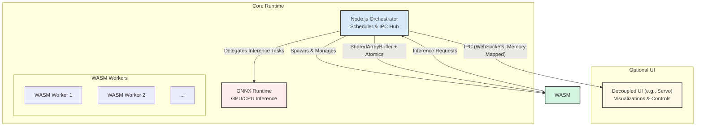

# Architecture Design: A Deterministic, Multi-Agent Runtime

## 1. Architectural Vision & Core Principles

This document defines the architecture for a local-first, multi-agent runtime. Our primary goal is to create a high-performance, headless-first system capable of executing both CPU-bound agent logic and GPU-bound machine learning tasks in a way that is safe, modular, and—above all—deterministic.

This design is guided by the following core principles, which inform every architectural decision:

This architecture builds upon the TSD v0.2 and PRD v0.5, incorporating determinism contracts, shared memory/message-passing standards, ABI & plugin security model, and quantifiable performance/reproducibility targets.

*   **Ordering-Only Determinism:** We guarantee that the logical order of agent tasks, messages, and state transitions is perfectly repeatable. This provides a stable foundation for debugging and reliability without enforcing bit-for-bit identical results, which is impractical in heterogeneous hardware environments involving GPUs.
*   **Safety and Isolation:** Agent execution is strictly sandboxed. Agents cannot interfere with one another or the host system, ensuring memory safety and fault tolerance.
*   **Performance through Specialization:** The architecture uses the best tool for each job—sandboxed WebAssembly for general-purpose CPU logic and a dedicated ML inference engine for GPU acceleration.
*   **Headless-First Modularity:** The core runtime is a self-contained, headless engine. Any user interface is an optional, fully decoupled component, ensuring the system is equally suited for server deployments and interactive applications.
*   **Cross-Platform Portability:** The runtime is designed to operate consistently across Linux, Windows, and macOS.

## 2. The Tri-Component Runtime Architecture

Our architecture is built on three specialized components, managed by a central orchestrator. This separation of concerns allows each component to excel at its specific task, resulting in a system that is both robust and performant.

### 2.1 The Node.js Orchestrator: The Central Nervous System

The Node.js runtime serves as the orchestrator, coordinating the entire multi-agent system. It is not merely a task runner; it is the source of truth for system state and the enforcer of our determinism contract.

**Key Responsibilities:**
*   **Agent Lifecycle Management:** Spawning, monitoring, and gracefully terminating WASM-based agents.
*   **Deterministic Task Scheduling:** Managing a global task queue to ensure a linear, repeatable order of operations. The initial implementation uses a FIFO/priority queue, with plans to evolve to a DAG-based scheduler.
*   **Inter-Process Communication (IPC) Hub:** Acting as the central message broker for all communication between agents, the ONNX runtime, and any optional UI.
*   **State Management & Replay Logging:** Overseeing the global state and maintaining logs that allow for exact replication of a session for debugging.
*   **Security & ABI Enforcement:** Verifying the signature and capabilities of agent plugins before execution.

### 2.2 The WASM Worker Pool: Sandboxed CPU Execution

All general-purpose agent logic is executed within a pool of WebAssembly (WASM) workers. Using Node.js `worker_threads`, each agent runs in a completely isolated, sandboxed environment.

**Key Responsibilities:**
*   **CPU-Bound Logic:** Executing agent code written in languages like Rust or C++ and compiled to WASM.
*   **Secure Sandboxing:** Providing a secure execution environment with no direct access to the host operating system. All system calls are brokered by the orchestrator.
*   **Resource Management:** Enforcing strict resource limits through instruction metering and time-slicing to prevent runaway processes.

### 2.3 The ONNX Runtime: Accelerated GPU Inference

For GPU-intensive tasks, primarily machine learning inference, the system delegates to the ONNX Runtime. This production-ready engine provides a stable and performant solution for running complex models.

**Key Responsibilities:**
*   **GPU-Bound Inference:** Executing LLMs and other ML models on the GPU for maximum performance.
*   **Reliable CPU Fallback:** Automatically transitioning to CPU-based inference if a compatible GPU is not available, guaranteeing functionality across all hardware.
*   **Model Management:** Handling the loading, caching, and versioning of ML models.
*   **Deterministic Execution:** Enforcing deterministic execution where possible, contributing to the overall reproducibility of the system.

## 3. System Interaction, Dataflow, and Memory Model

The synergy between the components is defined by a clear set of communication channels and a well-defined memory architecture.

### 3.1 Communication Channels

*   **Orchestrator ↔ WASM Workers:** Communication is achieved through a zero-copy, low-latency mechanism using `SharedArrayBuffer` and `Atomics`. This allows for high-speed data exchange without the overhead of serialization, while `Atomics` ensure thread-safe access to shared memory.
*   **Orchestrator ↔ UI / External Processes:** Communication with any decoupled UI or external tool is handled via standard IPC mechanisms, such as WebSockets or memory-mapped files. This is a pull-based model, where the UI requests snapshots of the state, preventing it from blocking the core runtime.

### 3.2 Architectural Diagram

### 3.3 Memory Architecture

*   **WASM Heap:** Each WASM worker operates on its own private, isolated linear memory heap.
*   **Shared Memory Region:** A pre-allocated `SharedArrayBuffer` acts as a synchronized bridge for data exchange between the orchestrator and the WASM workers.
*   **GPU Memory:** All GPU memory is managed exclusively by the ONNX Runtime. Neither the orchestrator nor the WASM agents can access GPU memory directly.

## 4. Agent Lifecycle and Security Model

### 4.1 Agent ABI & Plugin Security

Agents adhere to a strict Application Binary Interface (ABI) that defines their lifecycle and interaction with the orchestrator. The core ABI functions include:
*   `agent_init()`
*   `agent_step(context_ptr)`
*   `agent_receive(message_ptr)`
*   `agent_shutdown()`

To ensure security, all agent modules must be cryptographically signed. The orchestrator verifies the signature and declared capabilities of each module before execution, enforcing a "least privilege" model.

## 5. The Determinism Guarantee

Determinism is the cornerstone of this architecture. Our "Ordering-Only Determinism" contract guarantees repeatable behavior, which is essential for debugging and reliability.

### 5.1 Determinism Contracts

| Subsystem      | Guarantee                                                                                             |
|----------------|-------------------------------------------------------------------------------------------------------|
| **Scheduler**      | A linear, replayable FIFO/priority task queue. A deterministic tick clock drives the entire system.         |
| **WASM Agent**     | Bounded, metered execution ensures that for a given input and state, the output is always the same.       |
| **ONNX Runtime**   | CPU inference is bit-level reproducible. GPU inference is functionally deterministic.                     |
| **Messaging**  | Message order is guaranteed. All mutable state flows through the orchestrator and is logged for replay. |

### 5.2 Fault Handling and Isolation

*   Agent crashes are isolated to their respective WASM workers, allowing the orchestrator and other agents to continue running.
*   The orchestrator can preempt long-running or unresponsive agents using instruction metering.
*   ONNX Runtime failures gracefully fall back to CPU execution.

## 6. Performance & Reproducibility Targets

| Metric                  | Target                                 |
|-------------------------|----------------------------------------|
| Scheduler Tick Overhead | <10 ms per 50 agents                   |
| CPU Agent Step Time     | <5 ms                                  |
| ONNX Inference Variance | ±5% on GPU; bit-level reproducible on CPU |
| Message Throughput      | ≥10,000 messages/sec via orchestrator  |

## 7. Build and Deployment Strategy

The build process is designed for cross-platform compatibility. Agent code (Rust, C++, etc.) is compiled to WASM with multi-threading and SIMD support. The final application is packaged as a Node.js project, bundling the necessary `onnxruntime-node` native binaries for each target platform.

## 8. Future Architectural Evolution

This architecture is designed to be extensible. Future enhancements include:
*   **DAG-based Scheduler:** Evolving the scheduler to support complex, dependency-based agent workflows.
*   **Dynamic Worker Scaling:** Automatically adjusting the size of the WASM worker pool in response to system load.
*   **WASI Integration:** Leveraging the WebAssembly System Interface (WASI) for controlled and sandboxed access to system resources.
*   **Multi-Instance Federation:** Enabling communication and coordination between multiple runtime instances.
