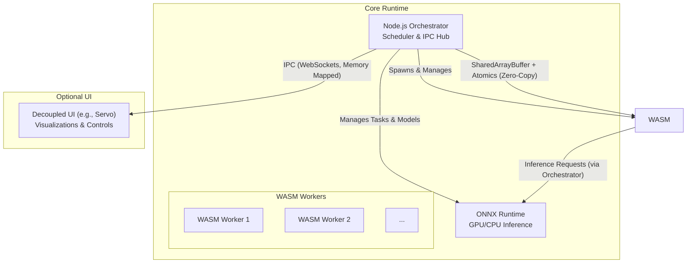

# Architecture Design Document (ADD): Local-First Multi-Agent Runtime

## 1. Introduction & Guiding Principles

### 1.1. Overview
This document defines the architecture for a local-first, deterministic multi-agent runtime. The system is designed for high-performance, reproducible execution of heterogeneous tasks, including CPU-bound agent logic in WebAssembly (WASM) and GPU-accelerated machine learning inference via ONNX. The architecture is headless-first, with a strictly decoupled, optional UI.

This design is the technical implementation of **PRD v0.5** and adheres to the principles outlined in **TSD v0.2**.

### 1.2. Architectural Principles
*   **Deterministic Execution**: All operations are repeatable. The system guarantees that for a given sequence of inputs, the outputs are identical.
*   **Component Isolation & Security**: Agents are fully sandboxed within WASM. All communication and system access are brokered by the central orchestrator, enforcing a strict security model.
*   **Performance & Efficiency**: The architecture leverages `SharedArrayBuffer` for zero-copy memory sharing and utilizes GPU hardware for ML inference to ensure high throughput and low latency.
*   **Modularity & Decoupling**: Components have well-defined responsibilities and interact through stable interfaces, allowing them to be developed, tested, and replaced independently.
*   **Cross-Platform Consistency**: The runtime is designed to operate identically across Linux, Windows, and macOS.

## 2. Logical View
This view describes the system's functional components and their primary responsibilities.

### 2.1. Node.js Orchestrator
The central nervous system of the runtime. It is a single Node.js process responsible for coordination and state management.
*   **Agent Lifecycle**: Manages the entire lifecycle of agents (spawn, monitor, terminate).
*   **Deterministic Scheduling**: Implements a deterministic task scheduler (initially FIFO/priority) to manage the execution order of agent tasks.
*   **IPC & Message Hub**: Acts as the central broker for all inter-component communication.
*   **State Management**: Owns the global state and manages replay logging for deterministic reproducibility.
*   **Security & ABI Enforcement**: Verifies plugin signatures and capabilities, enforcing the Agent ABI.

### 2.2. WebAssembly (WASM) Worker Pool
A pool of Node.js `worker_threads`, where each thread hosts a sandboxed WASM virtual machine for executing agent logic.
*   **Sandboxed Execution**: Provides a secure, memory-isolated environment for CPU-bound agent logic.
*   **Resource Management**: Enforces resource limits on agents through instruction metering and bounded step execution to prevent runaway processes.

### 2.3. ONNX Runtime
A dedicated module for executing machine learning models, acting as a managed resource for the orchestrator.
*   **Compute Abstraction**: Provides a unified interface for GPU- and CPU-bound ML inference.
*   **Model Management**: Handles the lifecycle of ML models (loading, caching, versioning).
*   **Deterministic Inference**: Configured for deterministic execution, with a reliable CPU fallback to ensure functional reproducibility.

### 2.4. Optional UI Layer
A strictly decoupled, read-only interface for visualization and monitoring (e.g., implemented in Servo).
*   **State Visualization**: Presents a read-only view of the system and agent states.
*   **Process Isolation**: Runs in a separate process and communicates asynchronously with the orchestrator, ensuring that it cannot impact the runtime's determinism or stability.

## 3. Process View
This view illustrates the dynamic interactions between the system's components.

### 3.1. Communication and Data Flow

*   **Orchestrator ↔ WASM Workers**: Communication is achieved through a pre-allocated `SharedArrayBuffer`, enabling zero-copy data transfer. Synchronization is managed with `Atomics` to ensure thread safety and prevent race conditions. This is the highest-performance communication path.
*   **Orchestrator ↔ ONNX Runtime**: The orchestrator sends inference requests and manages models via a dedicated API.
*   **Orchestrator ↔ UI**: Communication occurs via standard, asynchronous IPC mechanisms like WebSockets. The UI subscribes to state snapshots from the orchestrator on a pull basis.

### 3.2. Memory Model
*   **WASM Heap**: Each WASM agent operates in its own isolated linear memory.
*   **Shared Memory**: The `SharedArrayBuffer` acts as a carefully managed, shared memory region exclusively for orchestrator-WASM communication.
*   **GPU Memory**: Managed entirely by the ONNX Runtime. It is not directly accessible by any other component.

## 4. Development View
This view describes the key interfaces and contracts for developers building agents.

### 4.1. Agent ABI & Plugin Model
*   **Stable ABI**: Agents are developed against a stable Application Binary Interface (ABI) with four key functions: `agent_init()`, `agent_step(context_ptr)`, `agent_receive(message_ptr)`, and `agent_shutdown()`.
*   **Plugin Security**: Agent modules must be cryptographically signed and declare their required capabilities in a manifest. The orchestrator enforces version compatibility and grants access to resources based on these declarations.
*   **Strict Sandboxing**: Agents have no direct access to the host OS. All I/O and compute requests (like ML inference) must be brokered through the orchestrator.

## 5. Architectural Scenarios

### 5.1. Deterministic Replay
The architecture guarantees reproducibility through the following contracts:
| Subsystem          | Guarantee                                                                                                         |
| ------------------ | ----------------------------------------------------------------------------------------------------------------- |
| **Scheduler**      | A deterministic, logical clock drives a linear FIFO/priority queue, ensuring reproducible task ordering.            |
| **WASM Agent**     | Execution is bounded and metered. Given an identical input sequence, an agent will produce deterministic outputs.     |
| **ONNX Runtime**   | CPU execution is bit-level deterministic. GPU execution uses deterministic kernels where available, with a functional CPU fallback. |
| **Communication**  | All state changes are centrally managed by the orchestrator. Messages are ordered and logged for perfect replay.   |

### 5.2. Fault Handling
*   **Agent Crash**: An error within a WASM agent is contained within its sandbox. The orchestrator captures the fault and terminates the agent without affecting other agents or the runtime itself.
*   **Inference Failure**: An ONNX Runtime failure is managed by the orchestrator, which can fall back to the CPU or log the error without destabilizing the system.

## 6. Appendix

### 6.1. Performance & Reproducibility Targets
| Metric                  | Target                                        |
| ----------------------- | --------------------------------------------- |
| Scheduler Tick Overhead | < 10 ms per 50 agents                         |
| CPU Agent Step Latency  | < 5 ms under nominal workload                 |
| ONNX Inference Variance | ±5% on GPU; 100% bit-level reproducible on CPU |
| Message Throughput      | ≥ 10,000 messages/sec via orchestrator bus    |

### 6.2. Build & Deployment
*   Agent source code (Rust, C++) is compiled to WASM32 with multi-threading and SIMD support enabled.
*   The runtime is packaged as a Node.js application with `onnxruntime-node` as a native dependency.
*   The build system produces cross-platform binaries with the correct native libraries for each target OS.

### 6.3. Future Enhancements
*   **DAG-based Scheduler (v2)**: For more complex agent dependencies.
*   **Dynamic Worker Scaling**: Adjusting the size of the WASM worker pool based on load.
*   **WASI Integration**: For providing controlled and secure access to system resources.
*   **Multi-Instance Federation**: To enable communication and coordination between multiple runtime instances.
