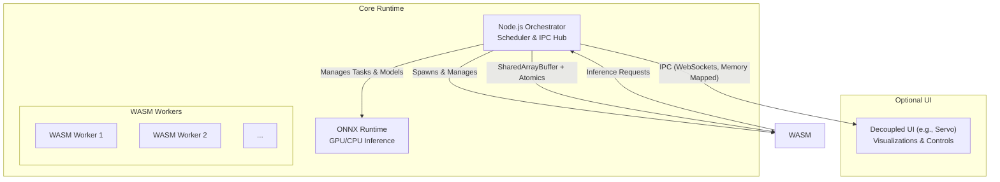

# Runtime Architecture for Multi-Agent Orchestration: WebAssembly (WASM) Stack
## Architecture Design Document

## 1. Overview

This document presents the **architecture of a local-first deterministic multi-agent runtime**, emphasizing high-performance execution of CPU-bound and GPU-bound tasks in a headless-first environment with optional, decoupled UI.

**Core Principles:**

* **Determinism:** All agent operations are repeatable and predictable.
* **Safety:** Memory safety and process isolation guaranteed via WASM sandboxing.
* **Performance:** GPU acceleration for ML inference and multi-threaded CPU execution.
* **Modularity:** Loosely coupled components; clear separation between core runtime and UI.
* **Cross-Platform:** Supports Linux, Windows, and macOS.

This architecture builds upon the TSD v0.2 and PRD v0.5, incorporating determinism contracts, shared memory/message-passing standards, ABI & plugin security model, and quantifiable performance/reproducibility targets.

---

## 2. System Components

### 2.1 Node.js Orchestrator

* **Description:** Central process coordinating all components.
* **Responsibilities:**

  * Agent lifecycle management (spawn, monitor, terminate)
  * Deterministic task scheduling (FIFO, priority; DAG deferred v2)
  * IPC hub for all inter-component messaging
  * Global state management and replay logging
  * Plugin verification and ABI enforcement

### 2.2 WebAssembly (WASM) Worker Pool

* **Description:** Node.js `worker_threads` running sandboxed WASM agents.
* **Responsibilities:**

  * CPU-bound agent logic execution
  * Memory-safe isolated execution per agent
  * Instruction metering, time slicing, bounded step execution

### 2.3 ONNX Runtime

* **Description:** ML inference engine for GPU/CPU models.
* **Responsibilities:**

  * GPU-bound inference for LLMs and ML models
  * CPU fallback if GPU unavailable
  * Model management (load, unload, cache, version tracking)
  * Deterministic execution enforcement

### 2.4 Optional UI Layer

* **Description:** Decoupled, read-only visualization and monitoring interface (e.g., Servo).
* **Responsibilities:**

  * Visualizing agent and system state
  * Read-only controls and metrics
* **Decoupling:** Runs in a separate process, communicates via IPC (WebSockets, memory-mapped files), never directly touches WASM or ONNX runtime.

---

## 3. Data Flow & Communication

* **Orchestrator ↔ WASM Workers:** `SharedArrayBuffer` + `Atomics` for zero-copy, low-latency communication. Ensures deterministic and thread-safe memory access.
* **Orchestrator ↔ UI / External Processes:** Standard IPC (WebSockets, memory-mapped files), pull-based snapshots to avoid blocking core runtime.

---

## 4. Memory Architecture

* **WASM Heap:** Each worker has isolated linear memory.
* **Shared Memory Region:** Pre-allocated `SharedArrayBuffer` for high-speed orchestrator ↔ WASM communication.
* **Synchronization:** Controlled via `Atomics` for thread safety.
* **GPU Memory:** Fully managed by ONNX Runtime; no direct access from agents or orchestrator.

---

## 5. Agent ABI & Plugin Security

* **ABI Functions:** `agent_init()`, `agent_step(context_ptr)`, `agent_receive(message_ptr)`, `agent_shutdown()`
* **Plugin Security:** Signed modules with declared capabilities; version and ABI compatibility enforced by orchestrator.
* **Sandboxing:** No direct OS access; all I/O and GPU calls brokered.

---

## 6. Determinism Contracts

| Subsystem          | Guarantee                                                                                                         |
| ------------------ | ----------------------------------------------------------------------------------------------------------------- |
| Scheduler          | Linear FIFO/priority queue; deterministic tick clock; DAG deferred v2                                             |
| WASM Agent         | Bounded, metered execution; deterministic outputs per input; no wall-clock I/O unless sandboxed                   |
| ONNX Runtime       | CPU deterministic; GPU deterministic where possible; CPU fallback preserves functional outputs                    |
| Messaging & Memory | All mutable state flows through orchestrator; SharedArrayBuffer + Atomics; message ordering per topic; replayable |

---

## 7. Fault Handling

* Agent crashes isolated; orchestrator continues
* WASM worker preemption via metering
* ONNX failures fallback to CPU
* Deterministic logging for replay

---

## 8. Performance & Reproducibility Targets

| Metric                  | Target                                 |
| ----------------------- | -------------------------------------- |
| Scheduler tick overhead | <10 ms per 50 agents                   |
| CPU agent step          | <5 ms                                  |
| ONNX inference variance | ±5% GPU, CPU bit-level reproducibility |
| Message throughput      | ≥10k messages/sec via orchestrator     |

---

## 9. Build & Deployment

* Compile agent code (Rust/C++) to WASM with multi-threading/SIMD enabled
* Node.js packaged runtime with `onnxruntime-node` dependencies
* Cross-platform builds include correct native ONNX binaries

---

## 10. Future Enhancements

* DAG-based scheduler (v2)
* Dynamic scaling of WASM workers
* Multi-instance federation
* Multi-tenant agent sandboxes
* WASI integration for controlled system resource access
