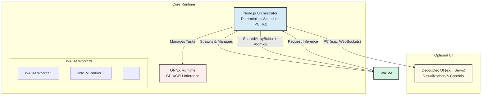

# Runtime Architecture for Multi-Agent Orchestration: WebAssembly (WASM) Stack
## Architecture Design Document

## 1. Overview

This document outlines the architecture for a local-first, multi-agent hybrid runtime. The system is designed for deterministic, high-performance execution of both CPU-bound and GPU-bound tasks, with a headless-first approach that supports an optional, decoupled user interface.

This architecture is the result of a critical review of a previous proposal involving Servo WebGPU, which was rejected due to risks associated with its experimental nature.

### Core Principles:
- **Determinism**: All agent operations are repeatable and predictable.
- **Safety**: The runtime guarantees memory safety and process isolation.
- **Performance**: The architecture leverages GPU acceleration for intensive computations and multi-threading for CPU tasks.
- **Modularity**: Components are loosely coupled, with a clear separation between core logic and the UI.
- **Cross-Platform**: The system is designed to run on Linux, Windows, and macOS.

---

## 2. System Components

The architecture is composed of three primary components, orchestrated by a Node.js runtime.

### 2.1 Node.js Orchestrator
- **Description**: A standard Node.js process that serves as the central nervous system of the application.
- **Responsibilities**:
    - **Agent Lifecycle Management**: Spawning, terminating, and monitoring agents.
    - **Deterministic Task Scheduling**: Managing task queues for all agents to ensure a reproducible order of execution. Supported strategies include round-robin and priority-based scheduling.
    - **IPC Hub**: Acting as the central message broker between all components.
    - **State Management**: Persisting and managing global application state.

### 2.2 WebAssembly (WASM) Worker Pool
- **Description**: A pool of Node.js `worker_threads`, each running a sandboxed WASM module.
- **Responsibilities**:
    - **CPU-Bound Agent Logic**: Executing the core application logic for each agent.
    - **Sandboxed Execution**: Isolating agents from each other and the main orchestrator process to ensure security and stability.
    - **High-Performance Computation**: Leveraging WASM's near-native performance for computationally intensive CPU tasks.

### 2.3 ONNX Runtime
- **Description**: A dedicated, production-ready inference engine for machine learning models.
- **Responsibilities**:
    - **GPU-Bound Inference**: Executing large language models (LLMs) and other ML models on the GPU.
    - **CPU Fallback**: Automatically falling back to CPU-based inference if a compatible GPU is not available, ensuring the application runs on any hardware.
    - **Model Management**: Loading, unloading, and managing different versions of ML models.

### 2.4 Optional UI Layer (e.g., Servo)
- **Description**: A completely decoupled graphical interface for visualization and monitoring.
- **Responsibilities**:
    - **Data Visualization**: Rendering the state of agents and the system.
    - **User Interaction**: Providing controls for managing the application.
- **Decoupling**: The UI runs in a separate process and communicates with the Node.js orchestrator via IPC. It has read-only access to application state and never interacts directly with the WASM workers or ONNX Runtime.

---

## 3. Data Flow & Communication

The system relies on two primary communication mechanisms to ensure both performance and safety.

- **In-Process (Orchestrator ↔ WASM Workers)**: `SharedArrayBuffer` with `Atomics` is used for high-throughput, low-latency communication. This allows for zero-copy data exchange, which is critical for performance-sensitive tasks. All memory access is synchronized with `Atomics` to prevent race conditions.

- **Cross-Process (Orchestrator ↔ UI / External Processes)**: For communication with the optional UI or other external systems, the orchestrator uses standard IPC mechanisms like WebSockets or sends data over memory-mapped files. This ensures a clean separation of concerns and prevents the UI from impacting the core runtime's stability.

---

## 4. Memory Architecture

- **WASM Heap**: Each WASM worker has its own sandboxed linear memory.
- **Shared Memory Region**: A pre-allocated `SharedArrayBuffer` is used as a common memory space for high-speed data exchange between the orchestrator and the WASM workers.
- **Synchronization**: All access to the shared memory region is strictly controlled using `Atomics` to ensure thread safety.
- **GPU Memory**: Managed entirely by ONNX Runtime. No direct memory access is performed from any other part of the system.

---

## 5. Build & Deployment

- **WASM Compilation**: Agent code (e.g., written in Rust or C++) is compiled to WASM modules with multi-threading and SIMD support enabled.
- **Node.js Environment**: The application is packaged as a standard Node.js project, with dependencies on `onnxruntime-node` and any other required libraries.
- **Cross-Platform Builds**: The build process generates artifacts for each target platform (Linux, Windows, macOS), ensuring that the correct native binaries for ONNX Runtime are included.

---

## 6. Future Enhancements

- **Advanced Scheduling**: Implementing more sophisticated scheduling algorithms, such as Directed Acyclic Graph (DAG) based scheduling for complex agent workflows.
- **Dynamic Worker Scaling**: Adjusting the size of the WASM worker pool based on system load.
- **WASI Integration**: Exploring the use of the WebAssembly System Interface (WASI) for more direct, yet still sandboxed, access to system resources from WASM modules.
