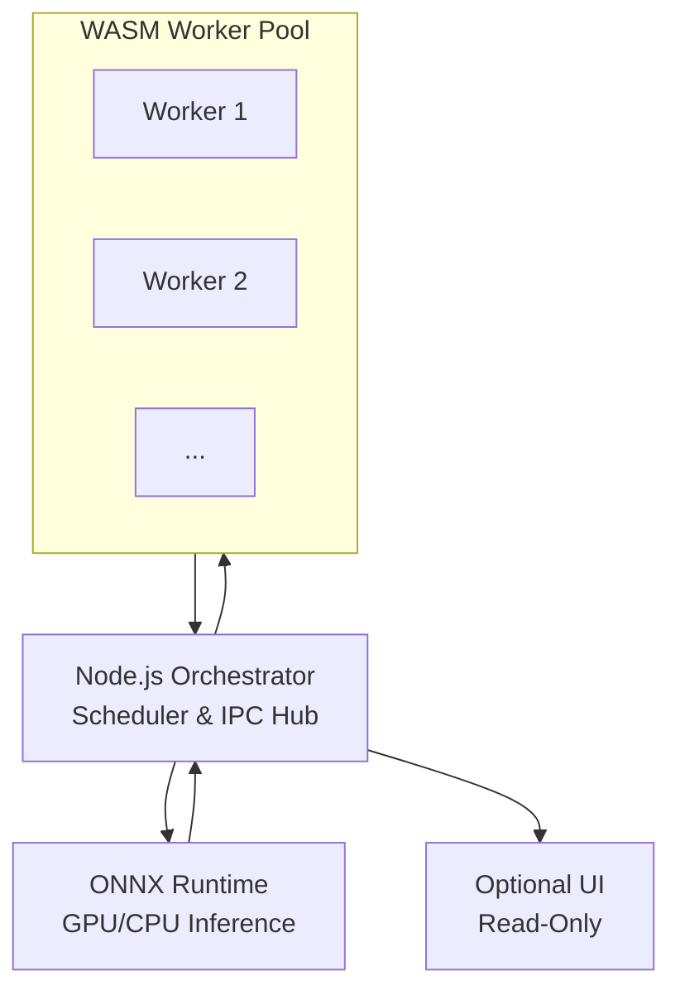

# Master Architecture Design Document (ADD)

**Title:** Local-First Deterministic Multi-Agent Runtime
**Status:** Proposed
**Version:** 0.1
**Date:** 2025-12-17
**Owners:** Engineering Team
**Reviewers:** CTO, Platform Architecture, Runtime Architects, ML Systems
**Tags:** Architecture, Runtime, Node.js, WASM, ONNX, Electron, WebGPU

---

## 1. Overview

This document consolidates the architecture of a **local-first, deterministic multi-agent runtime**. It provides a single reference for:

* Core runtime orchestration (Node.js + WASM + ONNX Runtime)
* Deterministic scheduling, memory safety, and agent execution contracts
* Optional decoupled UI layer
* Modular ADR-driven decision records for architectural clarity

**Key Architectural Principles:**

1. **Deterministic Execution:** Reproducible agent task ordering and state transitions.
2. **Isolation & Security:** WASM sandboxing, signed plugins, and controlled GPU/CPU access.
3. **Performance:** Multi-threaded CPU execution, GPU acceleration for inference.
4. **Modularity:** Loosely coupled subsystems; optional UI decoupled from core runtime.
5. **Cross-Platform:** Linux, Windows, macOS support.

---

## 2. Core Components

### 2.1 Node.js Orchestrator

* Central scheduler (FIFO/priority; DAG deferred to v2)
* Task queue management with deterministic tick clock
* Agent lifecycle management
* Plugin/ABI enforcement and versioning
* Replay logging and deterministic event tracking
* Interface to Model Management Service

### 2.2 WASM Worker Pool

* Executes CPU-bound agent logic in isolated threads
* Instruction metering and bounded step execution
* Communication via `SharedArrayBuffer` + `Atomics` with orchestrator
* No direct OS/GPU access

### 2.3 ONNX Runtime

* Executes GPU-bound inference with deterministic kernels
* CPU fallback for environments without GPU
* Centralized model management (load, unload, cache, versioning)
* Replayable inference requests logged

### 2.4 Optional UI Layer

* Fully decoupled, read-only visualization and monitoring
* IPC communication via WebSockets or memory-mapped files
* Never directly interacts with WASM or ONNX Runtime

---

## 3. Data Flow & Communication

### In-Process

* Orchestrator ↔️ WASM via `SharedArrayBuffer` + `Atomics`
* Zero-copy, thread-safe, deterministic memory access

### Cross-Process

* Orchestrator ↔️ UI via IPC (WebSockets, memory-mapped files)
* Pull-based snapshots to avoid blocking orchestrator

### Message Ordering & Replay

* Guaranteed per topic
* Backpressure applied when queues full
* Event logs support deterministic replay

---

## 4. Memory & Resource Management

* WASM heaps: isolated per worker
* Shared memory synchronized via `Atomics`
* GPU memory managed solely by ONNX Runtime
* Node.js orchestrator monitors CPU and memory usage

---

## 5. Determinism Contracts

| Subsystem          | Guarantee |
|-------------------|-----------|
| Scheduler          | Linear FIFO/priority queue; DAG deferred v2; tick clock ensures reproducibility |
| WASM Agent         | Bounded, metered execution; deterministic outputs per identical input |
| ONNX Runtime       | CPU deterministic; GPU deterministic if possible; functional consistency |
| Messaging & Memory | All mutable state flows through orchestrator; SharedArrayBuffer + Atomics; replayable messages |

**Ordering-Only Determinism** is applied across federated multi-agent execution (ADR-002).

---

## 6. Agent ABI & Plugin Model

* ABI v1: `agent_init()`, `agent_step()`, `agent_receive()`, `agent_shutdown()`
* Plugin signing, capability declarations, orchestrator-enforced versioning
* No direct OS or GPU access; all interactions brokered via orchestrator

---

## 7. Model Management & Inference

* Managed centrally by orchestrator or model service
* Model caching, load/unload, version tracking
* Deterministic execution enforced, CPU fallback preserves functional outputs
* GPU inference variance ±5%, CPU fully deterministic

---

## 8. Fault Handling

* Isolated agent crashes
* WASM worker preemption via instruction metering
* ONNX inference fallback to CPU
* Deterministic logging for replay and debugging

---

## 9. Performance & Reproducibility Targets

| Metric | Target |
|--------|--------|
| Scheduler tick overhead | <10 ms per 50 agents |
| CPU agent step | <5 ms |
| ONNX inference variance | ±5% GPU, CPU bit-level reproducibility |
| Message throughput | ≥10k msgs/sec via orchestrator |

---

## 10. Build & Deployment

* Compile agent code to WASM (Rust/C++), multi-threaded + SIMD enabled
* Node.js runtime packaged with required dependencies (`onnxruntime-node`)
* Cross-platform builds include correct ONNX binaries for Linux, Windows, macOS

---

## 11. Optional UI

* Servo: lightweight Rust-native UI for visualization
* Electron: full-featured UI if rich ecosystem is needed
* Always decoupled from compute; read-only, optional attachment

---

## 12. ADR References & Modular Decisions

---
adr_index:
  - id: ADR-001
    title: "[Shared Runtime (Node.js + WASM + ONNX)](../decision/ADR-001-hybrid-runtime.md)"
    status: "Approved"
    scope: "Core orchestrator, CPU/GPU execution, optional UI"

  - id: ADR-002
    title: "[Ordering-Only Determinism](../decision/ADR-002-determinism-ordering-only.md)"
    status: "Proposed"
    scope: "Scheduler & replay determinism"

  - id: ADR-003
    title: "[Scheduler Tick Granularity](../decision/ADR-003-scheduler-tick-granularity.md)"
    status: "Proposed"
    scope: "Logical tick duration, max tasks per tick"

  - id: ADR-004
    title: "[Shared Memory Ownership Rules](../decision/ADR-004-shared-memory-ownership-rules.md)"
    status: "Proposed"
    scope: "Single-writer, multi-reader policies"

  - id: ADR-005
    title: "[Plugin Signing & ABI Enforcement](../decision/ADR-005-plugin-signing-and-abi-enforcement.md)"
    status: "Proposed"
    scope: "Module security and ABI versioning"

  - id: ADR-006
    title: "[Performance & Latency Targets](../decision/ADR-006-performance-and-latency-targets.md)"
    status: "Proposed"
    scope: "Metrics for CPU/GPU and messaging"

  - id: ADR-007
    title: "[Logging Format & Serialization](../decision/ADR-007-logging-format-and-serialization.md)"
    status: "Proposed"
    scope: "Deterministic event serialization"

  - id: ADR-008
    title: "[Optional UI Framework](../decision/ADR-008-optional-ui-framework.md)"
    status: "Proposed"
    scope: "Servo vs Electron usage, decoupling"

  - id: ADR-009
    title: "[Model Caching & GPU Memory Policy](../decision/ADR-009-model-caching-and-gpu-memory-policy.md)"
    status: "Proposed"
    scope: "LRU caching, preloading heuristics"

  - id: ADR-010
    title: "[Agent SDK & Toolchain](../decision/ADR-010-agent-sdk-and-toolchain.md)"
    status: "Proposed"
    scope: "Languages, debugging, compliance tools"

  - id: ADR-011
    title: "[Fault Injection & Stress Testing](../decision/ADR-011-fault-injection-and-stress-testing.md)"
    status: "Proposed"
    scope: "Crash recovery and validation scenarios"

  - id: ADR-012
    title: "[Cross-Platform Build & Packaging](../decision/ADR-012-cross-platform-build-and-packaging.md)"
    status: "Proposed"
    scope: "Platform-specific artifacts and dependencies"

  - id: ADR-013
    title: "[DAG Scheduler v2 Guidelines](../decision/ADR-013-dag-scheduler-v2-guidelines.md)"
    status: "Proposed"
    scope: "Task objects, dependencies, v2 extensions"
---

---

## 13. Future Enhancements

* DAG-based scheduling (v2)
* Dynamic WASM worker scaling
* Multi-instance federation
* Multi-tenant agent sandboxes
* WASI integration
* Optional WebGPU/Dawn compute acceleration

---

## 14. References

* [ONNX Runtime Documentation](https://onnxruntime.ai/docs/)
* [WebAssembly Threads and Atomics (MDN)](https://developer.mozilla.org/en-US/docs/Web/JavaScript/Reference/Global_Objects/WebAssembly)
* [Node.js Worker Threads](https://nodejs.org/api/worker_threads.html)
* ADR-001 → ADR-013

---

**Notes:**
This master ADD is **modular** and ADR-driven, allowing each decision to be referenced independently. New ADRs can be added incrementally as the runtime evolves, making the document maintainable and reviewable for architecture and engineering teams.
