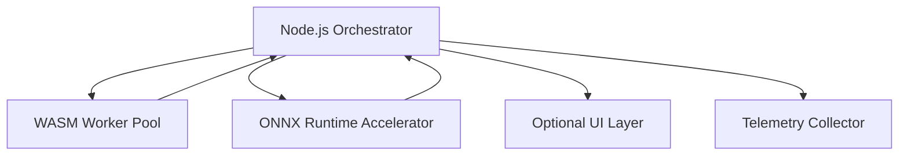

# Authoritative Technical Specification Document (ATSD) v0.2

**Shared Runtime: Node.js + WASM + ONNX Runtime for Local-First Multi-Agent Orchestration**

**Status:** Draft
**Version:** 0.2
**Date:** 2025-12-13
**Owners:** Engineering Team
**Reviewers:** CTO, Platform Architecture, Runtime Team

---

## 1. Purpose

This ATSD defines the authoritative technical specification for a local-first, deterministic multi-agent runtime. It formalizes component contracts, memory and compute flows, communication protocols, telemetry hooks, and federation/multi-tenant considerations, providing a robust engineering contract aligned with the PRD and ADR.

The runtime must:
-   Execute CPU-bound agent logic in WASM sandboxes
-   Execute GPU-bound inference via ONNX Runtime with CPU fallback
-   Guarantee deterministic scheduling and reproducible system behavior
-   Operate headless-first, optionally supporting decoupled UI
-   Support future DAG scheduling, federation, and multi-tenancy

---

## 2. System Components & Contracts

### 2.1 Node.js Orchestrator
-   **Responsibilities:**
    -   Lifecycle management of agents (spawn, step, terminate)
    -   Deterministic scheduling (round-robin, priority, DAG-ready placeholders)
    -   Mediates all inter-agent and external communication
    -   Maintains global state, snapshots, and telemetry hooks
-   **Interface Example:**
    ```typescript
    interface Orchestrator {
      spawnAgent(spec: AgentSpec): AgentId;
      scheduleTask(agentId: AgentId, task: Task): void;
      publish(topic: string, message: Message): void;
      send(agentId: AgentId, message: Message): void;
      joinChannel(agentId: AgentId, channel: string): void;
      snapshotState(): Snapshot;
      registerTelemetryHook(hook: TelemetryHook): void;
    }
    ```
-   **Deterministic Guarantees:**
    -   Task execution order reproducible across runs
    -   Snapshots can replay exact system state

### 2.2 WASM Worker Pool
-   **Responsibilities:**
    -   Execute CPU-bound agent logic in isolated sandboxes
    -   Enforce memory bounds and prevent orchestrator blocking
    -   Expose hooks for telemetry on each agent_step
-   **WASM ABI:**
    ```c
    int agent_init();
    int agent_step(void* context_ptr);
    int agent_receive(void* message_ptr);
    int agent_shutdown();
    ```
-   **Memory Isolation:**
    -   Private linear heap per agent
    -   Shared memory via `SharedArrayBuffer` + `Atomics`
    -   Zero mutable state escapes sandbox

### 2.3 ONNX Runtime Integration
-   **Responsibilities:**
    -   Execute GPU-bound inference deterministically
    -   CPU fallback guarantees reproducible results on all platforms
    -   Batch inference and centralized model management
-   **Interface Example:**
    ```typescript
    interface ModelRegistry {
      loadModel(modelId: string, version: string): void;
      unloadModel(modelId: string): void;
      infer(modelId: string, input: Tensor): Tensor;
      batchInfer(requests: Array<InferenceRequest>): Array<InferenceResponse>;
    }
    ```
-   **Telemetry Hooks:** Latency per inference, GPU vs CPU path, memory usage

### 2.4 Optional UI Layer
-   Read-only access via IPC (WebSockets or memory-mapped files)
-   Receives snapshots of agent state, task queues, and logs
-   Must never mutate runtime state

---

## 3. Data Flow & Memory Architecture

**Memory Layers:**
-   **WASM Heaps:** isolated per-agent
-   **Shared Memory:** high-speed exchange via `SharedArrayBuffer` + `Atomics`
-   **GPU Memory:** managed by ONNX Runtime
-   **Snapshots:** orchestrator serializes memory and task queue for replay

---

## 4. Deterministic DAG Scheduling (Future Placeholder)
-   Scheduler can accept task dependencies forming a DAG
-   Tasks execute in topologically sorted order, respecting priority
-   Ensures reproducibility even in complex multi-agent workflows
-   Backward-compatible with round-robin/priority scheduling

---

## 5. Federation & Multi-Tenancy (Future Placeholder)
-   **Federation:** snapshots serialized and transmitted between nodes; no shared memory across machines
-   **Multi-Tenancy:** resource isolation enforced per tenant; scheduler quotas per tenant
-   **Telemetry:** tenant-level metrics aggregated centrally

---

## 6. Message & Snapshot Schemas

**Agent Message Example:**
```json
{
  "agentId": "agent-123",
  "topic": "sensor_data",
  "payload": { "temperature": 22.5, "humidity": 45 },
  "timestamp": "2025-12-13T11:00:00Z"
}
```

**Task Example:**
```json
{
  "taskId": "task-456",
  "agentId": "agent-123",
  "priority": 5,
  "payload": { "compute": "embedding", "input": [1,2,3] }
}
```

**Snapshot Example:**
```json
{
  "agents": [ /* ... */ ],
  "schedulerQueue": [ /* ... */ ],
  "onnxModelStates": [ /* ... */ ],
  "timestamp": "2025-12-13T11:00:00Z"
}
```

---

## 7. Telemetry & Performance Metrics

| Component        | Metric                     | Expected              |
|------------------|----------------------------|-----------------------|
| Scheduler        | Tick latency               | <10ms under load      |
| WASM Workers     | Step time                  | <5ms per agent (CPU-bound) |
| ONNX Runtime     | Inference latency variance | <2% deviation CPU/GPU |
| Memory           | Shared buffer throughput   | >100k ops/sec         |
| UI IPC           | Serialization latency      | <2ms                  |

Telemetry hooks exposed at orchestrator, WASM step, ONNX inference, and snapshot points. Data logged in structured format for replay.

---

## 8. Versioning & Hot-Swap Rules
-   **WASM ABI:** Semantic versioning; backwards-compatible extensions only
-   **ONNX Models:** Versioned; orchestrator ensures deterministic swap points
-   **Agent Modules:** Versioned; snapshots include module version hashes for replay

---

## 9. Non-Functional Requirements
-   Deterministic execution, reproducible across runs and platforms
-   Full sandboxing and isolation
-   Headless-first operation; optional UI decoupled
-   Cross-platform (Linux, Windows, macOS)
-   Fault tolerance: crashes contained per WASM worker or inference task

---

## 10. Acceptance Criteria
1.  Deterministic execution reproducible across OS targets
2.  WASM workers maintain full isolation; no cross-agent memory leaks
3.  ONNX inference deterministic with CPU fallback
4.  Optional UI read-only; runtime unaffected when attached/detached
5.  Scheduler supports priority/round-robin, DAG placeholder integrated
6.  Telemetry metrics are collected per agent, per inference, per tick
7.  Snapshots reproduce identical global state
